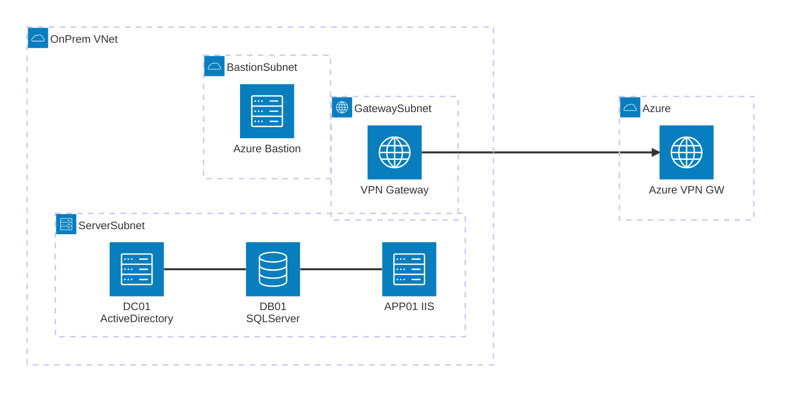

# 疑似オンプレミス環境 on Azure

Azure 上にオンプレミス環境を疑似的に再現し、Azure へのマイグレーション元として使用するラボ環境です。

## アーキテクチャ図



## 構成概要

| 要素 | 内容 |
|---|---|
| **OnPrem-VNet** (10.0.0.0/16) | 疑似オンプレミス環境全体 |
| **ServerSubnet** (10.0.1.0/24) | DC01, DB01, APP01 の3台を配置 |
| **GatewaySubnet** (10.0.255.0/27) | VPN Gateway (VpnGw1 / RouteBased) |
| **BastionSubnet** (10.0.254.0/26) | Azure Bastion による閉域管理アクセス |
| **NSG** | VNet 内通信のみ許可、インターネット Inbound 拒否 (テンプレートにより Outbound ルールが異なる) |

## サーバ構成

| サーバ名 | ホスト名 | IP アドレス | 役割 | OS / ソフトウェア |
|---|---|---|---|---|
| OnPrem-AD | DC01 | 10.0.1.4 | Active Directory / DNS | Windows Server 2022 |
| OnPrem-SQL | DB01 | 10.0.1.5 | データベース | SQL Server 2022 Developer on Windows Server 2022 |
| OnPrem-Web | APP01 | 10.0.1.6 | Web アプリケーション | IIS + ASP.NET 4.5 on Windows Server 2022 |

## テンプレート バリエーション

用途に応じて 3 種類の Bicep テンプレートを用意しています。

| テンプレート | 送信アクセス | アラート | 用途 |
|---|---|---|---|
| **main.bicep** | Azure 既定 IP で可能 | 「既定のアウトバウンド アクセス IP」警告あり | 手軽にテスト。2026/9/30 以降は非対応 |
| **main-closed.bicep** | 完全ブロック | なし | 閉域を厳格に再現。インターネット不要な場合 |
| **main-nat.bicep** | NAT Gateway 経由で可能 | なし | Windows Update・GitHub 等の外部アクセスが必要な場合 |

### 各テンプレートの違い

```
main.bicep              main-closed.bicep       main-nat.bicep
─────────────────────   ─────────────────────   ─────────────────────
defaultOutbound: (未設定) defaultOutbound: false  defaultOutbound: false
NSG Outbound: (なし)     NSG Outbound: Deny      NSG Outbound: (なし)
NAT Gateway: なし        NAT Gateway: なし        NAT Gateway: あり
─────────────────────   ─────────────────────   ─────────────────────
送信: Azure 既定 IP     送信: 完全ブロック      送信: NAT GW 固定 IP
```

> **注意**: `main.bicep` は Azure の[既定のアウトバウンド アクセスの廃止](https://learn.microsoft.com/azure/virtual-network/ip-services/default-outbound-access)に伴い、
> **2026 年 9 月 30 日以降に作成されたリソース**では既定の送信アクセスが利用できなくなります。

## ネットワーク設計

- **閉域構成**: パブリック IP はサーバに付与せず、NSG でインターネットからの Inbound を拒否
- **管理アクセス**: Azure Bastion 経由で RDP 接続
- **DNS**: VNet の DNS サーバとして DC01 (10.0.1.4) を指定
- **VPN**: S2S (Site-to-Site) VPN で Azure 側環境と接続

## デプロイ順序と依存関係

```
1. インフラ (VNet, NSG, Bastion, VPN Gateway)
2. VM 作成 (DC01, DB01, APP01) — 並列
3. AD 構築 (adSetupExtension) → 再起動
4. ドメイン参加 — AD 構築完了後:
   ├── DB01 ドメイン参加 (JsonADDomainExtension) → 再起動
   └── APP01 IIS インストール → ドメイン参加 (JsonADDomainExtension) → 再起動
```

## デプロイ方法

### 方法 1: PowerShell スクリプト (推奨)

再起動待機・エラーハンドリング付きのスクリプト [Deploy-OPLab.ps1](Deploy-OPLab.ps1) を使用します。
`-TemplateFile` パラメータでテンプレートを切り替えられます。

```powershell
# 既定の送信 IP あり (既定)
.\Deploy-OPLab.ps1 -ResourceGroupName "rg-onpre" -Location "japaneast"

# 閉域構成 (送信完全ブロック)
.\Deploy-OPLab.ps1 -ResourceGroupName "rg-onpre" -TemplateFile "infra/main-closed.bicep"

# NAT Gateway 付き (外部アクセス必要時)
.\Deploy-OPLab.ps1 -ResourceGroupName "rg-onpre" -TemplateFile "infra/main-nat.bicep"
```

### 方法 2: Azure CLI (Bicep 直接デプロイ)

```bash
# テンプレートを選択して指定
az deployment group create \
  --resource-group <リソースグループ名> \
  --template-file infra/<テンプレートファイル> \
  --parameters adminPassword='<パスワード>' vpnSharedKey='<共有キー>'
```

> **注意**: Bicep の直接デプロイでは、AD の再起動完了を ARM が完全に追跡できない場合があります。
> ドメイン参加が失敗した場合は、AD の再起動完了後に再デプロイしてください。

### パラメータ

| パラメータ | 必須 | 既定値 | 説明 |
|---|---|---|---|
| `adminUsername` | - | `labadmin` | 管理者ユーザー名 |
| `adminPassword` | **必須** | - | 管理者パスワード |
| `domainName` | - | `lab.local` | AD ドメイン名 |
| `vpnSharedKey` | **必須** | - | VPN 共有キー |
| `remoteGatewayIp` | - | (空) | Azure 側 VPN Gateway のパブリック IP |
| `remoteAddressPrefix` | - | `10.100.0.0/16` | Azure 側アドレス空間 |

### 送信インターネット アクセスに関する注意

`main-closed.bicep` (閉域構成) では以下の制限があります:

- `defaultOutboundAccess: false` + NSG `DenyInternetOutbound` により **VM からインターネットへの送信は完全に不可**
- Windows Update、KMS 認証、GitHub からのダウンロード、NuGet / Chocolatey 等のパッケージマネージャーは使用不可
- SQL Server CU の適用や外部スクリプトの実行も不可

これらが必要な場合は **`main-nat.bicep`** を使用してください。NAT Gateway 経由で固定 IP の送信アクセスが提供されます。

**参考資料:**

- [Default outbound access in Azure](https://learn.microsoft.com/azure/virtual-network/ip-services/default-outbound-access)
- [Azure NAT Gateway](https://learn.microsoft.com/azure/nat-gateway/nat-overview)

## Parts Unlimited Web アプリケーション

疑似オンプレ環境に Parts Unlimited (ASP.NET 4.5 MVC + SQL Server) をデプロイできます。
Parts Unlimited は Microsoft 公式のサンプル eCommerce サイトで、カテゴリ別商品一覧・ショッピングカート・注文管理などを備えています。

> **リポジトリについて**: ソースコードは [microsoft/PartsUnlimitedE2E](https://github.com/microsoft/PartsUnlimitedE2E) から取得しています。このリポジトリは **パブリック アーカイブ** (読み取り専用) であり、今後の更新はありません。ラボ用途のサンプルとしては安定したスナップショットとして利用できます。

> **前提**: インターネットへの送信アクセスが必要なため、**`main-nat.bicep`** でデプロイしてください。

### セットアップ手順

#### Step 1: DB01 — SQL Server の構成

Bastion 経由で **DB01** に RDP 接続し、管理者 PowerShell で実行:

```powershell
.\Setup-SqlServer.ps1 -SqlPassword 'P@ssw0rd1234'
```

実行内容:
- SQL Server 認証モードを混合モードに変更
- TCP/IP プロトコルの有効化
- ファイアウォール ポート 1433 の開放
- Parts Unlimited 用 SQL ログイン (`puadmin`) の作成

#### Step 2: APP01 — Parts Unlimited のビルド・デプロイ

Bastion 経由で **APP01** に RDP 接続し、管理者 PowerShell で実行:

```powershell
.\Setup-PartsUnlimited.ps1 -SqlPassword 'P@ssw0rd1234'
```

実行内容:
- Visual Studio Build Tools 2022 (Web ワークロード) のインストール
- ソースコードのダウンロード ([microsoft/PartsUnlimitedE2E](https://github.com/microsoft/PartsUnlimitedE2E))
- NuGet パッケージ復元 & MSBuild ビルド
- Web.config の接続文字列を DB01 向けに書き換え
- IIS サイト作成・デプロイ

#### Step 3: 動作確認

| 確認項目 | URL / 方法 |
|---|---|
| APP01 ローカル | `http://localhost` |
| VNet 内 (DC01/DB01 から) | `http://10.0.1.6` |
| 管理者ログイン | `Administrator@test.com` / `YouShouldChangeThisPassword1!` |

### スクリプトのパラメータ

#### Setup-SqlServer.ps1

| パラメータ | 必須 | 既定値 | 説明 |
|---|---|---|---|
| `SqlPassword` | **必須** | - | SQL ログインのパスワード |
| `SqlUser` | - | `puadmin` | SQL ログイン名 |

#### Setup-PartsUnlimited.ps1

| パラメータ | 必須 | 既定値 | 説明 |
|---|---|---|---|
| `SqlPassword` | **必須** | - | SQL ログインのパスワード (Setup-SqlServer.ps1 と同じ) |
| `SqlUser` | - | `puadmin` | SQL ログイン名 |
| `SqlServer` | - | `10.0.1.5` | SQL Server の IP アドレス |
| `SiteName` | - | `PartsUnlimited` | IIS サイト名 |
| `SitePort` | - | `80` | リッスン ポート |

### ドメイン名 `.local` に関する注意

既定のドメイン名 `lab.local` は `.local` サフィックスを使用しています。Microsoft の公式ドキュメントでは `.local` の使用は非推奨とされていますが、本環境は **Windows のみ・閉域・一時的なラボ** であるため、影響は限定的と判断し採用しています。

`.local` の既知の問題:

- **mDNS (Multicast DNS) との競合**: `.local` は RFC 6762 で mDNS 用に予約されており、Linux / macOS クライアントで DNS 解決が失敗・遅延する場合がある (本環境は Windows のみのため該当なし)
- **非ルーティング**: `.local` はインターネット上でルーティングされないため、パブリック CA による SSL 証明書の発行不可 (閉域環境のため該当なし)
- **Entra Domain Services**: マネージドドメインでは `.local` が非推奨

本番環境やマルチプラットフォーム環境では、所有ドメインのサブドメイン (例: `ad.contoso.com`) または RFC 2606 予約ドメイン (例: `corp.example.com`) の使用を推奨します。

**参考資料:**

- [Naming conventions in Active Directory for computers, domains, sites, and OUs](https://learn.microsoft.com/troubleshoot/windows-server/active-directory/naming-conventions-for-computer-domain-site-ou#domain-names)
- [Entra Domain Services - DNS naming requirements](https://learn.microsoft.com/entra/identity/domain-services/template-create-instance#dns-naming-requirements)
- [Deployment and operation of AD domains that use single-label DNS names](https://learn.microsoft.com/troubleshoot/windows-server/active-directory/deployment-operation-ad-domains)
