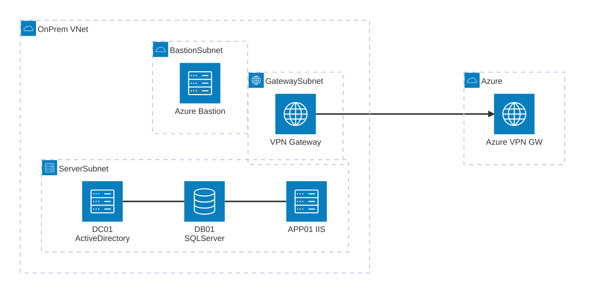

# 疑似オンプレミス環境 on Azure

Azure 上にオンプレミス環境を疑似的に再現し、Azure へのマイグレーション元として使用するラボ環境です。

## セットアップの流れ

本環境の構築は **2 段階** で行います。

1. **インフラ構築** (Bicep テンプレート) — VNet・NSG・Bastion・VPN Gateway と 3 台の Windows Server VM (DC01 / DB01 / APP01) を Azure 上にデプロイし、Active Directory ドメインの構成・ドメイン参加まで自動で行います。
2. **アプリケーション セットアップ** (PowerShell スクリプト) — Bastion 経由で各 VM に RDP 接続し、SQL Server の構成や Parts Unlimited Web アプリのビルド・デプロイを手動で実行します。

インフラだけで疑似オンプレミス環境として利用でき、アプリケーションのセットアップは必要に応じて実施してください。

## アーキテクチャ図



## 構成概要

| 要素 | 内容 |
|---|---|
| **OnPrem-VNet** (10.0.0.0/16) | 疑似オンプレミス環境全体 |
| **ServerSubnet** (10.0.1.0/24) | DC01, DB01, APP01 の3台を配置 |
| **GatewaySubnet** (10.0.255.0/27) | VPN Gateway (VpnGw1 / RouteBased) |
| **AzureBastionSubnet** (10.0.254.0/26) | Azure Bastion による閉域管理アクセス |
| **NSG** | VNet 内通信のみ許可、インターネット Inbound 拒否 (テンプレートにより Outbound ルールが異なる) |

## サーバ構成

| サーバ名 | ホスト名 | IP アドレス | 役割 | OS / ソフトウェア |
|---|---|---|---|---|
| OnPrem-AD | DC01 | 10.0.1.4 | Active Directory / DNS | Windows Server 2022 |
| OnPrem-SQL | DB01 | 10.0.1.5 | データベース | SQL Server 2022 Developer on Windows Server 2022 |
| OnPrem-Web | APP01 | 10.0.1.6 | Web アプリケーション | IIS + ASP.NET 4.5 on Windows Server 2022 |

## テンプレート バリエーション

用途に応じて 3 種類の Bicep テンプレートを用意しています。

| テンプレート | 送信アクセス | アラート | 用途 |
|---|---|---|---|
| **main.bicep** | Azure 既定 IP で可能 | 「既定のアウトバウンド アクセス IP」警告あり | 手軽にテスト。2026/9/30 以降は非対応 |
| **main-closed.bicep** | 完全ブロック | なし | 閉域を厳格に再現。インターネット不要な場合 |
| **main-nat.bicep** | NAT Gateway 経由で可能 | なし | Windows Update・GitHub 等の外部アクセスが必要な場合 |

### 各テンプレートの違い

```
main.bicep              main-closed.bicep       main-nat.bicep
─────────────────────   ─────────────────────   ─────────────────────
defaultOutbound: (未設定) defaultOutbound: false  defaultOutbound: false
NSG Outbound: (なし)     NSG Outbound: Deny      NSG Outbound: (なし)
NAT Gateway: なし        NAT Gateway: なし        NAT Gateway: あり
─────────────────────   ─────────────────────   ─────────────────────
送信: Azure 既定 IP     送信: 完全ブロック      送信: NAT GW 固定 IP
```

> **注意**: `main.bicep` は Azure の[既定のアウトバウンド アクセスの廃止](https://learn.microsoft.com/azure/virtual-network/ip-services/default-outbound-access)に伴い、
> **2026 年 9 月 30 日以降に作成されたリソース**では既定の送信アクセスが利用できなくなります。

## ネットワーク設計

- **閉域構成**: パブリック IP はサーバに付与せず、NSG でインターネットからの Inbound を拒否
- **管理アクセス**: Azure Bastion 経由で RDP 接続
- **DNS**: VNet の DNS サーバとして DC01 (10.0.1.4) を指定
- **VPN**: S2S (Site-to-Site) VPN で Azure 側環境と接続

> **VPN Gateway SKU に関する注意**: 本テンプレートではコスト優先で **`VpnGw1`** (非 AZ SKU) を使用しています。Azure Portal で VPN Gateway の設定を開くと「*VPN Gateway non-AZ SKUs are getting deprecated*」という警告が表示されますが、**ラボ用途では問題ありません**。Portal 上で VPN Gateway の構成を変更すると自動的に `VpnGw1AZ` にアップグレードされます。詳細は [VPN Gateway SKU の廃止に関するドキュメント](https://learn.microsoft.com/azure/vpn-gateway/vpn-gateway-about-skus-legacy) を参照してください。

## デプロイ順序と依存関係

```
1. インフラ (VNet, NSG, Bastion, VPN Gateway)
2. VM 作成 (DC01, DB01, APP01) — 並列
3. AD 構築 (adSetupExtension) → 再起動
4. ドメイン参加 — AD 構築完了後:
   ├── DB01 ドメイン参加 (JsonADDomainExtension) → 再起動
   └── APP01 IIS インストール → ドメイン参加 (JsonADDomainExtension) → 再起動
```

## デプロイ方法

### 方法 1: PowerShell スクリプト (推奨)

再起動待機・エラーハンドリング付きのスクリプト [Deploy-Lab.ps1](Deploy-Lab.ps1) を使用します。
`-TemplateFile` パラメータでテンプレートを切り替えられます。

```powershell
# 既定の送信 IP あり (既定)
.\Deploy-Lab.ps1 -ResourceGroupName "rg-onpre" -Location "japaneast"

# 閉域構成 (送信完全ブロック)
.\Deploy-Lab.ps1 -ResourceGroupName "rg-onpre" -TemplateFile "infra/main-closed.bicep"

# NAT Gateway 付き (外部アクセス必要時)
.\Deploy-Lab.ps1 -ResourceGroupName "rg-onpre" -TemplateFile "infra/main-nat.bicep"
```

### 方法 2: Azure CLI (Bicep 直接デプロイ)

```bash
# テンプレートを選択して指定
az deployment group create \
  --resource-group <リソースグループ名> \
  --template-file infra/<テンプレートファイル> \
  --parameters adminPassword='<パスワード>' vpnSharedKey='<共有キー>'
```

> **注意**: Bicep の直接デプロイでは、AD の再起動完了を ARM が完全に追跡できない場合があります。
> ドメイン参加が失敗した場合は、AD の再起動完了後に再デプロイしてください。

### 方法 3: Deploy to Azure ボタン

ブラウザから Azure Portal へ直接デプロイできます。

| テンプレート | ボタン |
|---|---|
| **既定 (送信 IP あり)** | [](https://portal.azure.com/#create/Microsoft.Template/uri/https%3A%2F%2Fraw.githubusercontent.com%2Fnksato%2Fazure-virtual-onprem%2Fmain%2Finfra%2Fmain.json) |
| **閉域構成** | [](https://portal.azure.com/#create/Microsoft.Template/uri/https%3A%2F%2Fraw.githubusercontent.com%2Fnksato%2Fazure-virtual-onprem%2Fmain%2Finfra%2Fmain-closed.json) |
| **NAT Gateway 付き (推奨)** | [](https://portal.azure.com/#create/Microsoft.Template/uri/https%3A%2F%2Fraw.githubusercontent.com%2Fnksato%2Fazure-virtual-onprem%2Fmain%2Finfra%2Fmain-nat.json) |

> **注意**: Deploy to Azure ボタンでは Deploy-Lab.ps1 のリトライ処理は行われません。
> ドメイン参加が失敗した場合は、AD の再起動完了後にもう一度ボタンからデプロイしてください。

### パラメータ

| パラメータ | 必須 | 既定値 | 説明 |
|---|---|---|---|
| `adminUsername` | - | `labadmin` | 管理者ユーザー名 |
| `adminPassword` | **必須** | - | 管理者パスワード |
| `domainName` | - | `lab.local` | AD ドメイン名 |
| `vpnSharedKey` | **必須** | - | VPN 共有キー |
| `remoteGatewayIp` | - | (空) | 接続先 VPN Gateway のパブリック IP (空の場合 S2S 接続はスキップ) |
| `remoteAddressPrefix` | - | `10.100.0.0/16` | 接続先のアドレス空間 |

### VPN 接続先の設定方法

初回デプロイ時は `remoteGatewayIp` が空（既定値）のため、VPN Gateway 本体のみ作成され、S2S 接続リソースはスキップされます。
接続先が決まったら、**同じコマンドにパラメータを追加して再デプロイ**するだけで S2S 接続が確立されます（既存リソースはそのまま維持されます）。

```bash
az deployment group create \
  --resource-group rg-onpre \
  --template-file infra/main.bicep \
  --parameters \
    adminPassword='<パスワード>' \
    vpnSharedKey='<共有キー>' \
    remoteGatewayIp='<接続先VPN GatewayのパブリックIP>' \
    remoteAddressPrefix='<接続先のアドレス空間>'
```

| パラメータ | 設定内容 | 例 |
|---|---|---|
| `remoteGatewayIp` | 接続先 VPN Gateway の**パブリック IP** | `20.xxx.xxx.xxx` |
| `remoteAddressPrefix` | 接続先の**アドレス空間** (CIDR) | `10.100.0.0/16` |
| `vpnSharedKey` | 両側で一致させる**事前共有キー** | 初回デプロイ時と同じ値 |

`remoteGatewayIp` を指定すると以下の 2 リソースが追加作成されます:

- **Local Network Gateway** (`Azure-LocalGw`) — 接続先の IP とアドレス空間を定義
- **S2S VPN 接続** (`OnPrem-to-Azure-S2S`) — IKEv2 / IPsec で接続

#### 接続先 (対向側) での設定

対向側の VPN デバイス / ゲートウェイにも以下を設定してください:

| 設定項目 | 値 |
|---|---|
| 疑似オンプレミス側パブリック IP | `vpnGatewayPublicIp` 出力値 (※) |
| 疑似オンプレミス側アドレス空間 | `10.0.0.0/16` |
| 事前共有キー | デプロイ時の `vpnSharedKey` と同じ値 |
| プロトコル | IKEv2 / IPsec |

※ 疑似オンプレミス側 VPN Gateway のパブリック IP はデプロイ出力から確認できます:

```bash
az deployment group show --resource-group rg-onpre --name main \
  --query properties.outputs.vpnGatewayPublicIp.value -o tsv
```

### 送信インターネット アクセスに関する注意

`main-closed.bicep` (閉域構成) では以下の制限があります:

- `defaultOutboundAccess: false` + NSG `DenyInternetOutbound` により **VM からインターネットへの送信は完全に不可**
- Windows Update、KMS 認証、GitHub からのダウンロード、NuGet / Chocolatey 等のパッケージマネージャーは使用不可
- SQL Server CU の適用や外部スクリプトの実行も不可

これらが必要な場合は **`main-nat.bicep`** を使用してください。NAT Gateway 経由で固定 IP の送信アクセスが提供されます。

**参考資料:**

- [Default outbound access in Azure](https://learn.microsoft.com/azure/virtual-network/ip-services/default-outbound-access)
- [Azure NAT Gateway](https://learn.microsoft.com/azure/nat-gateway/nat-overview)

## Parts Unlimited Web アプリケーション

疑似オンプレミス環境に Parts Unlimited (ASP.NET 4.5 MVC + SQL Server) をデプロイできます。
ソースコードは [microsoft/PartsUnlimitedE2E](https://github.com/microsoft/PartsUnlimitedE2E) (パブリック アーカイブ / 読み取り専用) から取得しています。
詳細なセットアップ手順は [docs/parts-unlimited-guide.md](docs/parts-unlimited-guide.md) を参照してください。

> **前提**: インターネットへの送信アクセスが必要なため、**`main.bicep`** または **`main-nat.bicep`** でデプロイしてください。

## ドメイン名 `.local` に関する注意

既定のドメイン名 `lab.local` は `.local` サフィックスを使用しています。Microsoft の公式ドキュメントでは `.local` の使用は非推奨とされていますが、本環境は **Windows のみ・閉域・一時的なラボ** であるため、影響は限定的と判断し採用しています。

`.local` の既知の問題:

- **mDNS (Multicast DNS) との競合**: `.local` は RFC 6762 で mDNS 用に予約されており、Linux / macOS クライアントで DNS 解決が失敗・遅延する場合がある (本環境は Windows のみのため該当なし)
- **非ルーティング**: `.local` はインターネット上でルーティングされないため、パブリック CA による SSL 証明書の発行不可 (閉域環境のため該当なし)
- **Entra Domain Services**: マネージドドメインでは `.local` が非推奨

本番環境やマルチプラットフォーム環境では、所有ドメインのサブドメイン (例: `ad.contoso.com`) または RFC 2606 予約ドメイン (例: `corp.example.com`) の使用を推奨します。

**参考資料:**

- [Naming conventions in Active Directory for computers, domains, sites, and OUs](https://learn.microsoft.com/troubleshoot/windows-server/active-directory/naming-conventions-for-computer-domain-site-ou#domain-names)
- [Entra Domain Services - DNS naming requirements](https://learn.microsoft.com/entra/identity/domain-services/template-create-instance#dns-naming-requirements)
- [Deployment and operation of AD domains that use single-label DNS names](https://learn.microsoft.com/troubleshoot/windows-server/active-directory/deployment-operation-ad-domains)
